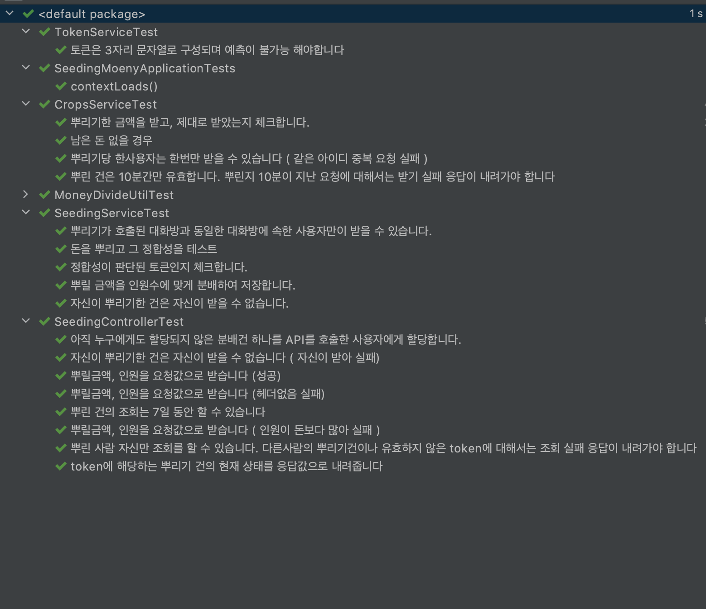

# 2020 카카오페이 돈 뿌리기 

## 1. 개발 환경
* spring-boot-2.3.1.RELEASE
* postgresql
* spring-boot-jpa
* lombok

## 2. 요구 및 제약 사항
### 2.0. 요구사항
* 어플리케이션이 다수의 서버에 다수의 인스턴스로 동작하더라도 기능에문제가 없도록 설계되어야 합니다.

### 2.1. 뿌리기 API
* 뿌릴 금액, 뿌릴 인원을 요청값으로 받습니다.
* 뿌리기 요청건에 대한 고유 token을 발급하고 응답값으로 내려줍니다.
* 뿌릴 금액을 인원수에 맞게 분배하여 저장합니다.
* token은 3자리 문자열로 구성되며 예측이 불가능해야 합니다. 

### 2.2. 받기 API
* 뿌리기 시 발급된 token을 요청값으로 받습니다.
* token에 해당하는 뿌리기 건 중 아직 누구에게도 할당되지 않은 분배건 하나를
API를 호출한 사용자에게 할당하고, 그 금액을 응답값으로 내려줍니다.
* 뿌리기당 한사용자는 한번만 받을 수 있습니다.
* 자신이 뿌리기한 건은 자신이 받을 수 없습니다.
* 뿌리기가 호출된 대화방과 동일한 대화방에 속한 사용자만이 받을 수
있습니다.
* 뿌린 건은 10분간만 유효합니다. 뿌린지 10분이 지난 요청에 대해서는 받기
실패 응답이 내려가야 합니다.
 
### 2.3. 조회 API
* 다음 조건을 만족하는 조회 API를 만들어 주세요.
* 뿌리기 시 발급된 token을 요청값으로 받습니다.
* token에 해당하는 뿌리기 건의 현재 상태를 응답값으로 내려줍니다. 현재
상태는 다음의 정보를 포함합니다.
* 뿌린시각,뿌린금액,받기완료된금액,받기완료된정보([받은금액,받은사용자 아이디] 리스트)
* 뿌린 사람 자신만 조회를 할 수 있습니다. 다른사람의 뿌리기건이나 유효하지
않은 token에 대해서는 조회 실패 응답이 내려가야 합니다.
* 뿌린건에 대한 조회는 7일동안 할 수 있습니다. 

## 3. 문제해결
### 3.1 뿌리기API 토큰중복 이슈
~~~
뿌리기 시, 정말 희박한 확률로 같은 방에 동일한 토큰값이 생성 될 경우가 발생
~~~
> 뿌리기 정보를 가져올 때, 토큰 과 방의 정보를 이용해서 가져옴, 만약 위의 상황과 같을 때 같은 정보를
두개 가지고 오는 상황이 발생함.
1. 뿌릴 시점에 생성된 토큰값을 체크해 혹시 같은 토큰이 생성되었다면, 익셉션으로 재요청을 요구함.

### 3.2. 받기API 동시성 이슈
~~~
받기 시, 누구에게도 할당받지 않은 분배건을 할당 받을 시, 다른 사용자간의 경합상황이 발생
~~~
> 만약 두 사용자간 경합상황 발생 시, 업데이트를 동시에 치게 되며 두 사용자는 동일 한 응답을 받게 되겠지만, 
결과적으로는 조금 더 늦게 업데이트를 한 사용자에게 분배건이 돌아감
1. **entity 낙관적 락**을 통해, 조금 더 빠르게 요청한 사용자에게 분배건이 돌아가며 늦게 한 사용자에겐
다시 시도해 달라는 익셉션이 발생 하도록 처리. 

### 3.3 동시성 이슈, 다중 인스턴스에 대한 고민
~~~
현재 동시성 체크에 대한 이슈를 순전히 데이터베이스에 위임
~~~
> 이 경우 대량의 트래픽 발생 시, 데이터베이스에 부하가 몰릴 수 있음 적절하게 책임을 분배하고 동시성의 체크가 필요해 보임
1. **Redis** 를 사용한 분배락 사용 고려
2. **Queue 서버**를 기동해, 큐로 처리

## 4. 테스트

## 5. API

### 5.1. 뿌리기API
#### Request
~~~
request(POST) : http://localhost:8080/api/seeding
header : {
    Content-Type : application/json,
    X-ROOM-ID : TEST,
    X-USER-ID : 123
}
body : {
    "amount": 1000,
    "receiverNumber" : 3
}
~~~

#### Response
~~~
{
    "code": "0000",
    "message": "정상",
    "body": {
        "token": "z6c",
        "issuedAt": "2020-11-23T00:20:29.03451"
    }
}
~~~

### 5.2. 받기API
#### Request
~~~
request(PUT) : http://localhost:8080/api/harvest/z6c
header : {
    Content-Type : application/json,
    X-ROOM-ID : TEST,
    X-USER-ID : 1231
}
~~~

#### Response
~~~
{
    "code": "0000",
    "message": "정상",
    "body": {
        "userId": 1231,
        "receiveAmount": 460.23,
        "harvestAt": "2020-11-23T00:23:22.860843"
    }
}
~~~

### 5.3. 받기API
#### Request
~~~
request(GET) : http://localhost:8080/api/inquire/z6c
header : {
    Content-Type : application/json,
    X-ROOM-ID : TEST,
    X-USER-ID : 123
}
~~~

#### Response
~~~
{
    "code": "0000",
    "message": "정상",
    "body": {
        "userId": 123,
        "roomId": "TEST1",
        "totalAmount": 1000.00,
        "usingAmount": 460.23,
        "seedingAt": "2020-11-23T00:20:28.948978",
        "cropsList": [
            {
                "userId": 1231,
                "receiveAmount": 460.23,
                "harvestAt": "2020-11-23T00:23:22.860843"
            }
        ]
    }
}
~~~
